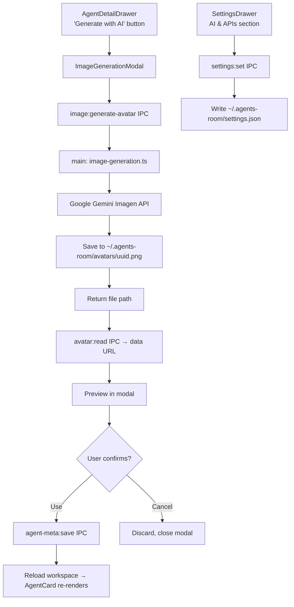

# Agent Image Generation Design

**Spec**: `.specs/features/agent-image-gen/spec.md`
**Status**: Implemented

---

## Architecture Overview

The Agent Image Generation feature integrates Google Gemini Imagen API to generate custom avatars and card backgrounds for agents. All API calls execute in the Electron main process to avoid exposing the API key to the renderer. Generated images follow the existing avatar pipeline: saved to `~/.agents-room/avatars/`, served via IPC data URL conversion, and persisted in the store.



---

## Code Reuse Analysis

### Existing Components to Leverage

| Component | Location | How to Use |
|---|---|---|
| `AgentDetailDrawer` | `src/renderer/src/components/AgentDetailDrawer.tsx` | Add "Generate with AI" button in portrait section; open `ImageGenerationModal` |
| `AvatarImg` | `src/renderer/src/components/AvatarImg.tsx` | Display generated image preview in modal |
| `avatar:read` IPC | `src/main/ipc-handlers.ts:193-206` | Converts file path → base64 data URL; reuse for preview display |
| `avatar:pick` IPC | `src/main/ipc-handlers.ts:565-589` | Existing avatar pipeline (copy to `avatars/`, return path); reuse file-save logic |
| `DrawerShell` | `src/renderer/src/components/ui/DrawerShell.tsx` | Backdrop + side panel structure for SettingsDrawer |
| `GitHubTokenModal` | `src/renderer/src/components/GitHubTokenModal.tsx` | Pattern for API key settings: input, status badge, save/clear, error state machine |
| `AgentMeta.save()` | `src/main/surreal-store.ts:273-278` | Update agent store with `avatarPath`; extend with `cardBackground` |
| `AgentView` type | `src/renderer/src/types/agent.ts:28-30` | Already includes `meta: AgentMeta | null` with `avatarPath` support |

### Integration Points

| System | Integration Method |
|---|---|
| Store (`agentMeta`) | Extend `AgentMeta` with `cardBackground?: string` in `src/main/surreal-store.ts` |
| IPC API bridge | Add `image:generate-avatar`, `image:generate-background`, `settings:get`, `settings:set` to `src/preload/index.ts` ElectronAPI interface |
| IPC handlers | Register new handlers in `src/main/ipc-handlers.ts` |
| Settings persistence | New file `~/.agents-room/settings.json` — dedicated get/set in store module |
| AgentCard rendering | Update `AgentCard` to render `cardBackground` with dark overlay if present |
| Canvas re-render | Existing `onSaveAgentMeta()` callback in `src/renderer/src/App.tsx` triggers workspace reload → card refresh |

---

## Components

### New: `ImageGenerationModal`

- **Purpose**: Modal for generating avatars/backgrounds — prompt editor, loading state, preview, confirm/cancel
- **Location**: `src/renderer/src/components/ImageGenerationModal.tsx`
- **Interfaces**:
  ```typescript
  interface Props {
    agentName: string
    agentDescription?: string
    agentModel?: string
    agentTools?: string[]
    type: 'avatar' | 'background'
    onClose: () => void
    onConfirm: (imagePath: string) => void
  }
  ```
- **State**: `prompt`, `isGenerating`, `generatedImageUrl` (data URL after avatar:read), `error`, `lastPrompt`
- **Dependencies**: `window.api.image.generateAvatar`, `window.api.avatar.read`, lucide-react (Wand2, RefreshCw icons)
- **Reuses**: `AvatarImg` for preview, error/loading pattern from `GitHubTokenModal`

### New: `SettingsDrawer`

- **Purpose**: Settings panel for API keys; first section is "AI & APIs" (Gemini key)
- **Location**: `src/renderer/src/components/SettingsDrawer.tsx`
- **Interfaces**:
  ```typescript
  interface Props {
    onClose: () => void
  }
  ```
- **State**: `geminiApiKey`, `saveState: 'idle' | 'saving' | 'saved' | 'error'`, `error`
- **Dependencies**: `window.api.settings.get`, `window.api.settings.set`, `DrawerShell`
- **Reuses**: `GitHubTokenModal` layout pattern (password input, status badge, save/clear buttons)

### New: `src/main/image-generation.ts`

- **Purpose**: Encapsulates all Gemini Imagen API calls; keeps `ipc-handlers.ts` clean
- **Location**: `src/main/image-generation.ts`
- **Interfaces**:
  ```typescript
  async function generateImage(prompt: string, type: 'avatar' | 'background', apiKey: string): Promise<string>
  // returns absolute path to saved image file
  ```
- **Dependencies**: `@google/generative-ai` npm package, `fs`, `path`, `crypto` (uuid generation)
- **Reuses**: Same `~/.agents-room/avatars/` directory used by `avatar:pick`

### Modified: `AgentDetailDrawer`

- Add "Generate with AI" button (Wand2 icon) in the portrait overlay section
- Add state `[generationModalOpen, setGenerationModalOpen]` and `[generationTarget, setGenerationTarget]: 'avatar' | 'background'`
- `onConfirm` in modal → calls `onSaveMeta({ avatarPath: path })` or `onSaveMeta({ cardBackground: path })`

### Modified: `AgentCard`

- Read `agent.meta?.cardBackground`
- If present: call `avatar:read` IPC to get data URL, render as absolute background with `bg-black/60` overlay
- Fallback: existing initials + gradient display unchanged

### Modified: `AgentsRoom` / App header

- Add gear icon button in top bar → toggles `settingsOpen` state
- Render `<SettingsDrawer />` conditionally

### Modified: `src/preload/index.ts`

- Extend `ElectronAPI`:
  ```typescript
  image: {
    generateAvatar: (prompt: string) => Promise<{ success: boolean; imagePath?: string; error?: string }>
    generateBackground: (prompt: string) => Promise<{ success: boolean; imagePath?: string; error?: string }>
  }
  settings: {
    get: () => Promise<AppSettings>
    set: (updates: Partial<AppSettings>) => Promise<{ success: boolean; error?: string }>
  }
  ```

---

## Data Models

### `AppSettings` (new — `~/.agents-room/settings.json`)

```typescript
interface AppSettings {
  geminiApiKey?: string      // plaintext v1; v2+ use OS keychain
  anthropicApiKey?: string   // reserved for ai-assisted-creation feature
}
```

### `AgentMeta` extension

```typescript
interface AgentMeta {
  // existing fields...
  avatarPath?: string
  cardBackground?: string   // NEW: path to background image (~/... format)
}
```

### IPC types

```typescript
interface GenerateImageRequest {
  prompt: string
  type: 'avatar' | 'background'
}

interface GenerateImageResponse {
  success: boolean
  imagePath?: string   // absolute path, ~/... stored in meta
  error?: 'API_KEY_NOT_CONFIGURED' | 'INVALID_API_KEY' | 'RATE_LIMIT' | 'NETWORK_ERROR' | 'UNKNOWN'
}
```

---

## Error Handling Strategy

| Error Scenario | Detection | User Message | Recovery |
|---|---|---|---|
| API key not configured | `settings.json` missing `geminiApiKey` | "Gemini API key not configured. [Open Settings]" | Link opens SettingsDrawer |
| Invalid/expired key | API returns 401 | "Invalid Gemini API key. Check your settings." | User corrects key in Settings |
| Rate limit | API returns 429 | "Rate limit reached. Try again in a moment." | Retry button in modal |
| Network error | Fetch throws | "Network error. Check your connection." | Retry button |
| Invalid image format | Parse/write fails | "Unexpected image format. Try regenerating." | Regenerate button |
| `avatars/` dir missing | `mkdir` fails | Auto-create directory in IPC handler | Transparent to user |
| Empty prompt on generate | Client-side check | Button disabled; tooltip "Enter a prompt first" | Pre-fill auto-prompt |

---

## Tech Decisions

| Decision | Choice | Rationale |
|---|---|---|
| Gemini model | TBD at implementation — `imagen-3.0-generate-fast-001` or `gemini-2.0-flash-preview-image-generation` | Confirm availability and pricing at implementation time via Google AI docs |
| Settings file | `~/.agents-room/settings.json` separate from `store.json` | Keeps API keys separate from metadata; future-proof for more keys |
| Image naming | `<uuid>.png` for avatar, `<uuid>-bg.png` for background | Same directory, no collision, clear intent |
| API library | `@google/generative-ai` (official Google SDK) | Official, maintained, Electron-compatible |
| API call location | Main process only (`image-generation.ts`) | API key must never reach renderer bundle |
| Auto-prompt format | `"Professional AI agent avatar for [name], [description]. Tools: [tools]. Style: minimal, dark theme."` | Reasonable default; user can edit in modal |
| Card background overlay | `bg-black/60` (Tailwind) over background image | Preserves text legibility at all brightness levels |
| Settings UI entry point | Gear icon in AgentsRoom header | Consistent with app conventions; avoids cluttering canvas |

---

## Files to Create / Modify

### Create
- `src/renderer/src/components/ImageGenerationModal.tsx`
- `src/renderer/src/components/SettingsDrawer.tsx`
- `src/main/image-generation.ts`

### Modify
- `src/preload/index.ts` — extend `ElectronAPI` with `image:*` and `settings:*`
- `src/main/ipc-handlers.ts` — register new handlers
- `src/main/surreal-store.ts` — add `cardBackground` to `AgentMeta`, add settings get/set
- `src/renderer/src/types/agent.ts` — add `cardBackground?: string` to `AgentMeta`
- `src/renderer/src/components/AgentDetailDrawer.tsx` — "Generate with AI" button + modal state
- `src/renderer/src/components/AgentCard.tsx` — render background if present
- `src/renderer/src/components/AgentsRoom.tsx` — gear button + SettingsDrawer render

---

## Research Needed at Implementation Time

1. **Google AI SDK**: Confirm `@google/generative-ai` image generation call signature and response format
2. **Model availability**: Which Imagen model is currently recommended (`imagen-3.0-generate-fast-001` vs `gemini-2.0-flash-preview-image-generation`)
3. **Image output format**: Does the API return base64 or a URL? What dimensions?
4. **Error codes**: Map Google API error codes to user-friendly messages

---

## Success Criteria

- [ ] User configures Gemini API key once; persists across restarts
- [ ] Avatar generated in < 30s end-to-end; persists after app restart
- [ ] API key never exposed in renderer bundle or DevTools
- [ ] Error messages are actionable (API key missing links to Settings)
- [ ] Background images render with dark overlay; text on card remains legible
