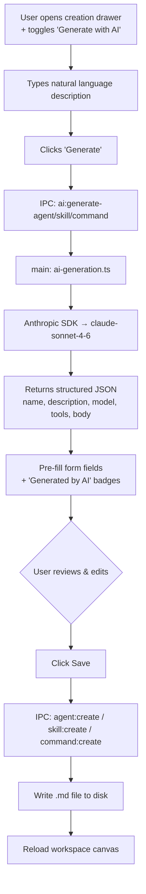

# AI-Assisted Creation Design

**Spec**: `.specs/features/ai-assisted-creation/spec.md`
**Status**: Draft

---

## Architecture Overview

The AI-assisted creation feature extends the existing agent/skill/command authoring UI with an optional AI generation step powered by the Anthropic Claude API. All API calls execute in the Electron main process to protect the API key.



---

## Code Reuse Analysis

### Existing Components to Leverage

| Component | Location | How to Use |
|---|---|---|
| `CreateSkillDrawer` | `src/renderer/src/components/CreateSkillDrawer.tsx` | Template for `CreateAgentDrawer`; add AI section (description field + Generate button + loading) |
| `CreateCommandDrawer` | `src/renderer/src/components/CreateCommandDrawer.tsx` | Extend with AI generation section |
| `DrawerShell` | `src/renderer/src/components/ui/DrawerShell.tsx` | Reuse as wrapper for all creation drawers |
| `skill:create` IPC | `src/main/ipc-handlers.ts:443-467` | Pattern for `agent:create`; YAML frontmatter + body format |
| `command:create` IPC | `src/main/ipc-handlers.ts:519-539` | Reuse as-is for AI-generated commands |
| `WorkspaceGroupBox` | `src/renderer/src/components/WorkspaceGroupBox.tsx:49-68` | `SubgroupLabel` already has `onAdd` button for skills/commands; add agent "+" |
| `AgentsRoom` | `src/renderer/src/components/AgentsRoom.tsx` | Manage state for new `CreateAgentDrawer` (open flag, onCreated callback) |
| Preload API bridge | `src/preload/index.ts` | Extend `ElectronAPI.skillAuthoring` with generate* and createAgent methods |
| Settings storage | `src/main/ipc-handlers.ts:403-439` | Store `anthropicApiKey` in `~/.agents-room/settings.json` alongside `geminiApiKey` |

### Integration Points

| Layer | Existing Interface | New Addition |
|---|---|---|
| Renderer → Main | `window.electronAPI.skillAuthoring` | Add `.generateAgent()`, `.generateSkill()`, `.generateCommand()`, `.createAgent()` |
| Main IPC handlers | `ipcMain.handle()` in `ipc-handlers.ts` | Add `ai:generate-agent`, `ai:generate-skill`, `ai:generate-command`, `agent:create` |
| Anthropic SDK | (not yet in deps) | Add `@anthropic-ai/sdk` to `package.json`; wrapped in `src/main/ai-generation.ts` |
| Settings file | `~/.agents-room/settings.json` | Add `anthropicApiKey` field (same file as `geminiApiKey`) |
| File creation | `skill:create`, `command:create` | Add `agent:create` handler (new); same YAML + body pattern |

---

## Components

### New: `CreateAgentDrawer`

- **Purpose**: Mirrors `CreateSkillDrawer` for agents; supports AI generation toggle
- **Location**: `src/renderer/src/components/CreateAgentDrawer.tsx`
- **Interfaces**:
  ```typescript
  interface Props {
    workspaces: WorkspaceEntry[]
    defaultWorkspacePath?: string
    open: boolean
    onClose: () => void
    onCreated: (workspacePath: string) => void
  }
  ```
- **Form fields**: workspace dropdown, name, description, AI toggle, generation description textarea, model, tools (array), body
- **State**:
  ```typescript
  const [useAI, setUseAI] = useState(false)
  const [generationDescription, setGenerationDescription] = useState('')
  const [generating, setGenerating] = useState(false)
  const [generationError, setGenerationError] = useState('')
  const [generatedFields, setGeneratedFields] = useState(new Set<string>())
  ```
- **Key methods**:
  - `handleGenerateWithAI()` — calls `window.electronAPI.skillAuthoring.generateAgent()`, populates form, marks `generatedFields`
  - `handleFieldChange(field)` — removes field from `generatedFields` (clears badge)
  - `handleSubmit()` — calls `window.electronAPI.skillAuthoring.createAgent()`
- **Reuses**: `CreateCommandDrawer` pattern (workspace dropdown, loading state, error handling, `DrawerShell`)

### New: `src/main/ai-generation.ts`

- **Purpose**: Wraps Anthropic SDK; handles generation for agents, skills, and commands
- **Location**: `src/main/ai-generation.ts`
- **Interfaces**:
  ```typescript
  export async function generateAgent(req: { description: string }): Promise<GenerateAgentResponse | AIGenerationError>
  export async function generateSkill(req: { description: string }): Promise<GenerateSkillResponse | AIGenerationError>
  export async function generateCommand(req: { description: string }): Promise<GenerateCommandResponse | AIGenerationError>
  export async function getAnthropicApiKey(): Promise<string | null>
  ```
- **Dependencies**: `@anthropic-ai/sdk`, settings reader from `surreal-store.ts` or direct `settings.json` read
- **Never imported in renderer** — main process only

### Modified: `CreateSkillDrawer` + `CreateCommandDrawer`

- Add state: `useAI`, `generationDescription`, `generating`, `generationError`, `generatedFields`
- Add toggle "Generate with AI" above name field
- When toggle ON: show textarea for description + "Generate" button
- On fields populated by AI: show inline badge "Generated by AI"
- On field edit: remove badge from that field
- Backward compat: when toggle OFF, form works exactly as before

### Modified: `WorkspaceGroupBox`

- Add `onCreateAgent?: () => void` prop
- Add "+" button to agents `SubgroupLabel` following same pattern as skills/commands (line 49–68)

### Modified: `AgentsRoom`

- Add state: `[createAgentOpen, setCreateAgentOpen]`, `[createAgentDefaultWorkspacePath, setCreateAgentDefaultWorkspacePath]`
- Pass `onCreateAgent` callback to `WorkspaceGroupBox`
- Render `<CreateAgentDrawer />` alongside skill/command drawers
  ```typescript
  const handleAgentCreated = (workspacePath: string): void => {
    setCreateAgentOpen(false)
    onReloadWorkspace(workspaces.find(w => w.path === workspacePath)?.id ?? 'global')
  }
  ```

### Modified: `src/preload/index.ts`

```typescript
skillAuthoring: {
  // ... existing
  generateAgent: (payload: { description: string }) => ipcRenderer.invoke('ai:generate-agent', payload),
  generateSkill:  (payload: { description: string }) => ipcRenderer.invoke('ai:generate-skill', payload),
  generateCommand:(payload: { description: string }) => ipcRenderer.invoke('ai:generate-command', payload),
  createAgent: (payload: CreateAgentPayload) => ipcRenderer.invoke('agent:create', payload),
}
```

### Modified: `src/main/ipc-handlers.ts`

Add 4 new handlers after the existing skill/command authoring block:

```typescript
// ── AI-assisted generation ──────────────────────────────────────────
ipcMain.handle('ai:generate-agent',   async (_e, p) => generateAgent(p).catch(err => ({ error: err.message })))
ipcMain.handle('ai:generate-skill',   async (_e, p) => generateSkill(p).catch(err => ({ error: err.message })))
ipcMain.handle('ai:generate-command', async (_e, p) => generateCommand(p).catch(err => ({ error: err.message })))

// ── Agent creation ──────────────────────────────────────────────────
ipcMain.handle('agent:create', (_e, { name, description, model, tools, body, workspacePath }) => {
  // validates name, resolves agentsDir (workspacePath/.claude/agents or ~/.claude/agents)
  // mkdirSync recursive, writeFileSync YAML frontmatter + body
  // returns { success: true } or { error: 'NAME_CONFLICT' | 'NAME_INVALID' | 'WRITE_FAILED' }
})
```

---

## Data Models

### Generation request/response types

```typescript
// src/main/ai-generation.ts

export interface GenerateAgentResponse {
  name: string
  description: string
  model: string
  tools: string[]
  body: string
}

export interface GenerateSkillResponse {
  name: string
  description: string
  model: string
  body: string
}

export interface GenerateCommandResponse {
  name: string
  body: string
}

export interface AIGenerationError {
  error: string
  code?: string
}
```

### `AppSettings` extension (shared with agent-image-gen)

```typescript
// ~/.agents-room/settings.json
interface AppSettings {
  geminiApiKey?: string      // agent-image-gen
  anthropicApiKey?: string   // ai-assisted-creation (NEW)
}
```

### `CreateAgentPayload` (IPC)

```typescript
interface CreateAgentPayload {
  name: string
  description: string
  model: string
  tools: string[]
  body: string
  workspacePath: string   // '' = global ~/.claude/agents
}
```

---

## Prompt Design

### Agent system prompt (in `ai-generation.ts`)

```
You are an expert Claude Code agent designer. Turn natural language descriptions into production-ready agent configurations.

Return ONLY valid JSON with this exact structure:
{
  "name": "kebab-case-name",
  "description": "One-line summary under 100 chars",
  "model": "claude-opus-4 or claude-sonnet-4-6",
  "tools": ["Bash", "Read", "Grep"],
  "body": "Markdown prompt..."
}

Model selection:
- Deep code analysis, security review, complex algorithms → claude-opus-4
- Most other tasks → claude-sonnet-4-6

Tools: Only include if the agent genuinely needs them. Options: Bash, Read, Grep, Search, Edit, Write.
Body: Clear structured markdown with headers and examples.
```

### Skill system prompt

Same pattern, output: `{ name, description, model, body }`. Model usually `claude-sonnet-4-6`.

### Command system prompt

Minimal: `{ name, body }`. Name = slug. Body = concise prompt for the slash command.

---

## Error Handling Strategy

| Scenario | IPC Response | UX Message |
|---|---|---|
| API key not configured | `{ error: 'NO_API_KEY' }` | "Anthropic API key not configured. [Open Settings]" |
| Invalid/expired key | `{ error: 'INVALID_KEY' }` | "Authentication failed. Check your API key in Settings." |
| Empty generation description | Client-side guard | Inline: "Describe what you want to generate" |
| Malformed JSON from Claude | `{ error: 'INVALID_RESPONSE' }` | "Generation returned unexpected content. Try again." |
| Name conflict on save | `{ error: 'NAME_CONFLICT' }` | "An item with this name already exists." |
| Write fails | `{ error: 'WRITE_FAILED' }` | "Could not save file. Check disk permissions." |
| Network error | `{ error: 'NETWORK_ERROR' }` | "Network error. Check your connection." |
| Rate limit (429) | `{ error: 'RATE_LIMITED' }` | "API rate limit reached. Wait a moment and retry." |
| Drawer closed mid-generation | IPC completes silently | No error; drawer closes, result discarded |

---

## Tech Decisions

| Decision | Choice | Rationale |
|---|---|---|
| Generation model | `claude-sonnet-4-6` | Current model; spec explicitly names it; sufficient quality for generation tasks |
| Response format | Structured JSON | Deterministic parsing; no regex; easy form population; schema-validatable |
| Streaming | Non-streaming (full response) | ~2–3s generation time; simpler UX; avoids chunk-to-renderer complexity |
| API key storage | `~/.agents-room/settings.json` field `anthropicApiKey` | Same file as `geminiApiKey`; single settings source; plain-text acceptable for v1 local app |
| Workspace selection | Explicit dropdown in drawer | Mirrors `CreateCommandDrawer`; avoids ambiguity in multi-workspace setups |
| AI badge on fields | `Set<string>` of field names | Transparent; encourages review; removed on edit; simple state |
| Tool suggestion | Delegated to Claude (in prompt) | Claude is better at matching tools to use cases than heuristics |
| `agent:create` target dir | `workspacePath/.claude/agents/` or `~/.claude/agents/` for global | Mirrors how agents-reader discovers agents; consistent with existing structure |

---

## Files to Create / Modify

### Create
- `src/main/ai-generation.ts` — Anthropic SDK wrapper
- `src/renderer/src/components/CreateAgentDrawer.tsx` — new drawer

### Modify
- `src/main/ipc-handlers.ts` — 4 new handlers
- `src/renderer/src/components/CreateSkillDrawer.tsx` — AI section
- `src/renderer/src/components/CreateCommandDrawer.tsx` — AI section
- `src/renderer/src/components/WorkspaceGroupBox.tsx` — agent "+" button
- `src/renderer/src/components/AgentsRoom.tsx` — CreateAgentDrawer state + render
- `src/preload/index.ts` — expose new IPC methods
- `package.json` — add `@anthropic-ai/sdk`

---

## Success Criteria

- [ ] API key in `settings.json` never reaches renderer bundle
- [ ] Generated agent `.md` is valid and recognized by Claude Code
- [ ] Tool names in `tools[]` are valid Claude Code tools
- [ ] Name conflicts detected before write; error shown inline
- [ ] Form validation blocks names with `/`, `\`, or leading `.`
- [ ] Closing drawer mid-generation has no side effects
- [ ] Generated fields show badge; editing removes badge
- [ ] All three types (agent/skill/command) work end-to-end
