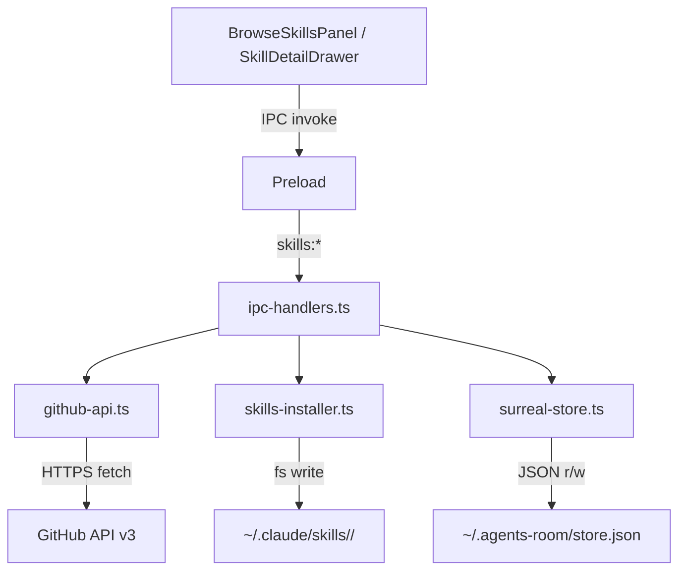

# Skills Install — Design

**Spec**: `.specs/features/skills-install/spec.md`
**Status**: Draft

---

## Architecture Overview

All GitHub API calls run in the **main process** — never the renderer. This avoids CORS, keeps trust logic out of the renderer sandbox, and lets us use Node's `fetch` (available in Electron 33 / Node 20+) without additional libraries.



**IPC namespace:** `skills:browse-sources`, `skills:list-from-source`, `skills:preview-url`, `skills:install`, `skills:uninstall`, `skills:get-meta`

---

## Code Reuse Analysis

### Existing Components to Leverage

| Component | Location | How to Use |
|---|---|---|
| `readStore` / `writeStore` | `src/main/surreal-store.ts` | Add `skillMeta` key to `StoreData`; follow existing pack/unpack pattern |
| `AgentMeta` store pattern | `src/main/surreal-store.ts` | Mirror for `SkillMeta` — same key format `skillName::sourcePath` |
| `rel()` / `abs()` path helpers | `src/main/surreal-store.ts` | Store `sourceUrl` as-is (URLs not paths), no rel/abs needed |
| `SkillDetailDrawer` | `src/renderer/src/components/SkillDetailDrawer.tsx` | Add origin section + uninstall button at bottom |
| `SectionHeader` local component | `SkillDetailDrawer.tsx` | Reuse for "Origin" section header |
| `typeBadge` CVA variant | `src/renderer/src/lib/variants.ts` | May extend for trust tier badges |
| Drawer/overlay pattern | `AgentDetailDrawer`, `WorkspaceDetailDrawer` | Same `fixed inset-0` overlay + `fixed right-0` panel |
| `TrashPanel` portal pattern | `TrashPanel.tsx` | `BrowseSkillsPanel` is also a panel — follow same mounting approach |
| `gray-matter` | already installed | Parse SKILL.md frontmatter from raw GitHub content |
| `react-markdown` + `remark-gfm` | already installed | Preview skill body in browse panel |

### Integration Points

| System | Integration Method |
|---|---|
| `workspaces:load-items` IPC | After install, renderer should refetch skills for global workspace to show new card |
| `SkillItem` type | Extend with optional `meta: SkillMeta \| null` (mirrors `AgentView` pattern) |
| Sidebar | Add "Browse Skills" button below the skills section header in `WorkspaceSidebar.tsx` or `AgentsRoom.tsx` |

---

## New Files

| File | Purpose |
|---|---|
| `src/main/github-api.ts` | GitHub API client: URL parser, repo info, directory listing, file download |
| `src/main/skills-allowlist.ts` | Hardcoded trusted sources list + trust tier resolver |
| `src/main/skills-installer.ts` | Install (download + write to fs) and uninstall (rm dir) logic |
| `src/renderer/src/components/BrowseSkillsPanel.tsx` | Discovery + URL install UI panel |

---

## Components

### `github-api.ts` (main process)

- **Purpose**: All GitHub API communication. URL parsing, rate-limit handling, content fetching.
- **Location**: `src/main/github-api.ts`
- **Interfaces**:
  - `parseGitHubUrl(url: string): GitHubRef | null` — parses any GitHub URL into `{ owner, repo, path, branch }`
  - `fetchRepoInfo(owner: string, repo: string): Promise<GitHubRepoInfo>` — stars, org, description
  - `fetchDirectoryContents(owner: string, repo: string, path: string, branch: string): Promise<GitHubDirEntry[]>` — list files/folders
  - `fetchFileContent(owner: string, repo: string, path: string, branch: string): Promise<string>` — raw file content
  - `fetchSkillPreview(ref: GitHubRef): Promise<RemoteSkillCard>` — resolves ref to a skill: finds SKILL.md, parses frontmatter, lists files
- **Dependencies**: Node `fetch`, `gray-matter`
- **Error surface**: Throws typed errors: `GH_NOT_FOUND`, `GH_RATE_LIMITED` (includes `resetAt: number`), `GH_NO_SKILL_MD`

### `skills-allowlist.ts` (main process)

- **Purpose**: Defines trusted sources and resolves trust tier for any GitHub URL.
- **Location**: `src/main/skills-allowlist.ts`
- **Interfaces**:
  - `TRUSTED_SOURCES: SkillSource[]` — exported constant; hardcoded list
  - `resolveTrustTier(owner: string, repo: string): TrustTier` — `'trusted'` if in list, `'known'` for any public GitHub, `'unknown'` otherwise
- **Initial allowlist**: Empty on first release. Structure is defined; Anthropic entry added when official repo exists. A `// TODO: add anthropics/claude-skills when available` comment marks the placeholder.
- **Dependencies**: None

### `skills-installer.ts` (main process)

- **Purpose**: Write/remove skill files to `~/.claude/skills/<name>/`.
- **Location**: `src/main/skills-installer.ts`
- **Interfaces**:
  - `installSkill(ref: GitHubRef, skillName: string): Promise<string>` — downloads all files in the folder, writes to `~/.claude/skills/<skillName>/`, returns absolute install path. Cleans up on failure.
  - `uninstallSkill(skillName: string): Promise<void>` — removes `~/.claude/skills/<skillName>/` recursively
- **Install flow**: `mkdirSync` (creates `~/.claude/skills/` if needed) → fetch directory contents → for each file, `fetchFileContent` → `writeFileSync` → if any step throws, `rmSync` the partial folder
- **Dependencies**: `github-api.ts`, Node `fs`, `path`, `os`

### `surreal-store.ts` — extension

- **Purpose**: Persist `SkillMeta` (origin, tier, install date) per installed skill.
- **Location**: `src/main/surreal-store.ts` (existing file — extend)
- **Changes**:
  - Add `skillMeta: Record<string, SkillMeta>` to `StoreData` interface and `readStore` defaults
  - Add `getSkillMeta(skillName: string): SkillMeta | null`
  - Add `saveSkillMeta(meta: SkillMeta): void`
  - Add `removeSkillMeta(skillName: string): void`
  - Key format: `skillName` (folder name) — simple string, no path needed
- **Reuses**: `readStore` / `writeStore` pattern exactly

### `ipc-handlers.ts` — extension

- **Purpose**: Expose skills install operations to renderer via IPC.
- **Location**: `src/main/ipc-handlers.ts` (existing file — extend)
- **New handlers**:
  - `skills:browse-sources` → returns `TRUSTED_SOURCES` with listing for each (calls `fetchDirectoryContents`)
  - `skills:list-from-source` `(sourceId: string)` → returns `RemoteSkillCard[]` for a trusted source
  - `skills:preview-url` `(url: string)` → parses URL, fetches repo info + skill preview, returns `SkillPreview`
  - `skills:install` `(ref: GitHubRef, skillName: string)` → installs + saves `SkillMeta` to store
  - `skills:uninstall` `(skillName: string)` → uninstalls + removes `SkillMeta`
  - `skills:get-meta` `(skillName: string)` → returns `SkillMeta | null`
  - `skills:get-all-meta` → returns all `SkillMeta[]` (used by canvas to enrich `SkillItem`)

### `preload/index.ts` — extension

- **Purpose**: Expose `skills` namespace on `ElectronAPI`.
- **Location**: `src/preload/index.ts` (existing file — extend)
- **New namespace**:
  ```ts
  skills: {
    browseSources: () => Promise<SkillSourceWithListings[]>
    listFromSource: (sourceId: string) => Promise<RemoteSkillCard[]>
    previewUrl: (url: string) => Promise<SkillPreview>
    install: (ref: GitHubRef, skillName: string) => Promise<void>
    uninstall: (skillName: string) => Promise<void>
    getMeta: (skillName: string) => Promise<SkillMeta | null>
    getAllMeta: () => Promise<SkillMeta[]>
  }
  ```

### `BrowseSkillsPanel.tsx` (renderer)

- **Purpose**: Discovery panel (trusted sources + URL install). Full-height right panel, same visual pattern as `TrashPanel`.
- **Location**: `src/renderer/src/components/BrowseSkillsPanel.tsx`
- **Two tabs**:
  - **Browse** — lists skills from trusted sources; "Installed" state on cards already in `~/.claude/skills/`
  - **Install from URL** — text input, preview card with trust badge, confirm install
- **State machine** (local state):
  - `idle` → `loading` → `ready` | `error` | `rate-limited`
  - Install: `idle` → `installing` → `success` | `error`
- **Opened from**: A "Browse Skills" button added to the global workspace section in the sidebar. Icon: `Download` (lucide-react).
- **Reuses**: `fixed inset-0` overlay + `fixed right-0` panel, `SectionHeader` pattern, `typeBadge` for trust tier coloring

### `SkillDetailDrawer.tsx` — extension

- **Purpose**: Add origin section and uninstall button to existing drawer.
- **Location**: `src/renderer/src/components/SkillDetailDrawer.tsx` (existing — extend)
- **Changes**:
  - Accept `meta: SkillMeta | null` as prop (passed from parent who calls `skills:get-meta`)
  - Add "Origin" section after Info: source URL (as `<a>` tag), trust tier badge, install date
  - If `meta` exists: show "Uninstall" button in a danger zone at the bottom (two-step confirmation — mirrors workspace delete pattern)
  - If no `meta`: show "Local" label in the info table row (no action)

### `types/agent.ts` — extension

- **Purpose**: Add `SkillMeta` type; extend `SkillItem` with optional meta.
- **Changes**:
  - Add `SkillMeta` interface
  - Add `meta?: SkillMeta | null` to `SkillItem`
- **Note**: `SkillItem` already has `folderPath`; `skillName` = `folderPath.split('/').pop()`

---

## Data Models

### `SkillMeta` (store + types)

```typescript
export interface SkillMeta {
  skillName: string         // folder name in ~/.claude/skills/
  sourceUrl: string         // canonical GitHub URL of the skill folder
  sourceOwner: string       // "anthropics"
  sourceRepo: string        // "claude-skills"
  sourcePath: string        // path within repo ("" = root, "skills/my-skill" = subfolder)
  sourceBranch: string      // "main"
  trustTier: TrustTier      // 'trusted' | 'known' | 'unknown'
  installedAt: string       // ISO date string
}

export type TrustTier = 'trusted' | 'known' | 'unknown'
```

### `SkillSource` (allowlist)

```typescript
export interface SkillSource {
  id: string
  name: string              // "Anthropic Official"
  description: string
  owner: string
  repo: string
  path: string              // '' = repo root, 'skills' = subfolder
  branch: string
  url: string               // canonical GitHub URL
}
```

### `GitHubRef` (internal)

```typescript
export interface GitHubRef {
  owner: string
  repo: string
  path: string              // '' = repo root
  branch: string            // 'main' default when not in URL
}
```

### `GitHubRepoInfo`

```typescript
export interface GitHubRepoInfo {
  stars: number
  orgName: string | null
  description: string | null
  updatedAt: string
}
```

### `RemoteSkillCard` (browse listing)

```typescript
export interface RemoteSkillCard {
  name: string              // from SKILL.md frontmatter `name`
  description: string       // from frontmatter `description`
  model: string | null
  folderName: string        // GitHub directory name
  sourceUrl: string         // full GitHub URL to the folder
  files: string[]           // all files in the folder
  isInstalled: boolean      // cross-checked with ~/.claude/skills/
}
```

### `SkillPreview` (URL install preview)

```typescript
export interface SkillPreview {
  skill: RemoteSkillCard
  tier: TrustTier
  repoInfo: GitHubRepoInfo | null   // null when tier = 'unknown'
  ref: GitHubRef
}
```

### `StoreData` addition

```typescript
interface StoreData {
  // ... existing fields ...
  skillMeta: Record<string, SkillMeta>  // key = skillName
}
```

---

## Error Handling Strategy

| Error Scenario | Where handled | User sees |
|---|---|---|
| GitHub API 404 | `github-api.ts` throws `GH_NOT_FOUND` | "Skill not found at this URL." |
| GitHub rate limit (403 + X-RateLimit-Remaining: 0) | `github-api.ts` throws `GH_RATE_LIMITED { resetAt }` | "GitHub rate limit reached. Try again at HH:MM." |
| No `SKILL.md` in folder | `github-api.ts` throws `GH_NO_SKILL_MD` | "No SKILL.md found in this folder." |
| Install interrupted (partial write) | `skills-installer.ts` catches → `rmSync` partial folder → rethrows | "Install failed. No files were written." |
| Skill name conflict (already installed) | IPC handler checks before writing | Confirmation dialog in renderer |
| `~/.claude/skills/` does not exist | `skills-installer.ts` calls `mkdirSync({ recursive: true })` before writing | Transparent to user |
| Non-GitHub URL | `parseGitHubUrl` returns `null` | "Only GitHub URLs are supported." |
| Network unreachable | `fetch` throws | "Could not reach GitHub. Check your connection." |

---

## Tech Decisions

| Decision | Choice | Rationale |
|---|---|---|
| GitHub API transport | Node `fetch` (no new dep) | Electron 33 ships Node 20+ where `fetch` is stable. No `axios` or `node-fetch` needed. |
| GitHub API auth | None (unauthenticated) | 60 req/hour is enough for browse + install flows. OAuth is v2. |
| Skill folder detection | Presence of `SKILL.md` | Consistent with how `agents-reader.ts` already detects skills locally. |
| Allowlist storage | Hardcoded in `skills-allowlist.ts` | User-editable allowlists create security holes. Updates ship with app releases. |
| Browse panel placement | Right panel overlay (same as Trash) | Consistent with existing panel UX. Not a route — no need for routing. |
| Trust tier for `'known'` | GitHub stars + org display only | Not security — just transparency. Stars/org are hints, not guarantees. |
| Uninstall scope | Only skills with `SkillMeta` (installed via app) | Prevents accidental deletion of manually-placed skills the app didn't install. |
