# Agents Room

> A visual command center for everyone running multi-agent teams with Claude Code.

If you use Claude Code across multiple projects, you already know how fast things get out of hand. Agents scattered across repositories. No way to see which agent calls which. Settings files edited by hand. API keys stored in plain text. Agents Room fixes all of that — in one desktop app, on your machine, completely offline.

---

<!-- SCREENSHOT: Full canvas view showing multiple workspace boxes with agent cards, connection lines, and the system node -->
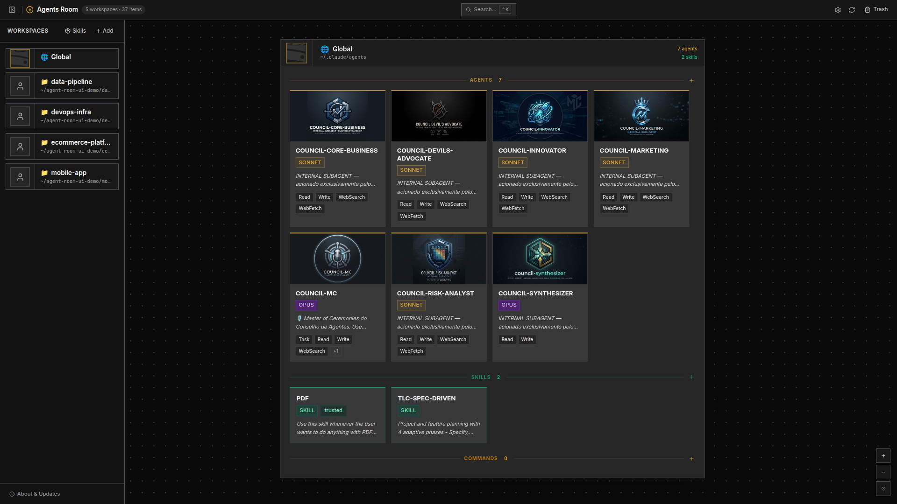

---

## Why Agents Room?

### You have agents. Lots of them. Organized in... files.

Claude Code agents live in `.claude/agents/` folders. Every project has its own. Some agents are global. Some call other agents. As your team and toolset grows, you end up with dozens of markdown files spread across your machine — and zero visibility into how they relate to each other.

Agents Room gives you back that visibility.

### One canvas. Every workspace. Every agent.

Open the app and see every Claude Code workspace on your machine laid out on a single, zoomable canvas. Each workspace is a draggable group. Each agent is a card. Relationships between agents — agent A calls agent B? — are drawn as connection lines automatically, without any configuration.

<!-- SCREENSHOT: Zoomed-in view of agent cards inside a workspace group box, showing model badges, tools, tags, and connection arrows -->
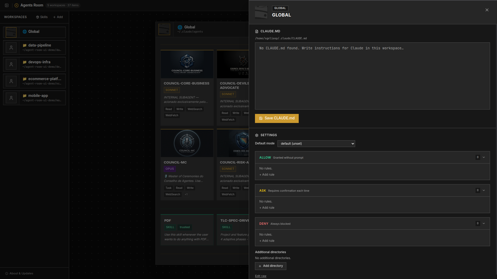

---

## What Makes It Different

### Create agents, skills, and commands from the UI

No more editing markdown files by hand. Use the **+** button on any workspace group to create agents, skills, and commands directly from the app. The file is written for you in the right place with the correct frontmatter format.

<!-- SCREENSHOT: CreateAgentDrawer open with name, description, model, tools, and body fields filled in -->
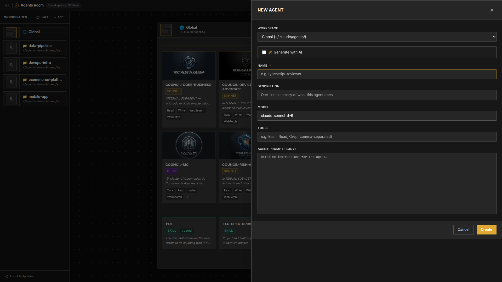

### AI-assisted creation

Enable the AI toggle in any creation drawer and describe what you want in plain language. Claude generates the name, description, model selection, tools list, and full system prompt body. Fields marked with an **AI** badge were generated — edit them freely and the badge clears.

<!-- SCREENSHOT: CreateAgentDrawer with AI toggle on, description field filled, and AI badges on the generated fields -->
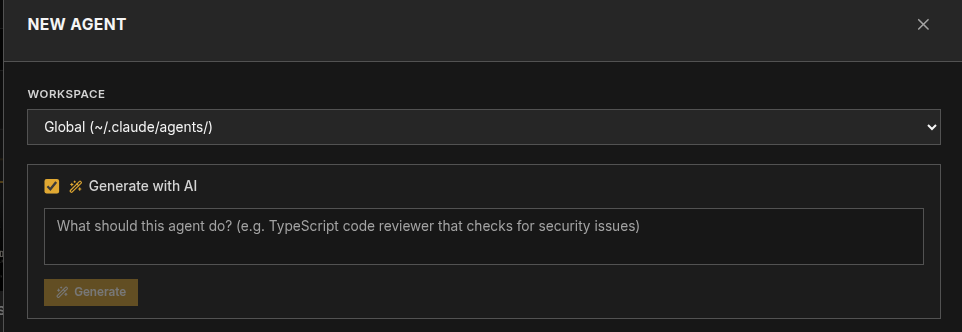

### AI image generation for agent cards

Give your agents a visual identity. From the agent detail drawer, click **Generate avatar with AI** or add a **Card Background** to generate images directly with Google Gemini. Generated images are saved locally and displayed on the canvas card with a subtle overlay for readability.

<!-- SCREENSHOT: Agent detail drawer showing the Generate Avatar and Card Background sections with a preview thumbnail -->
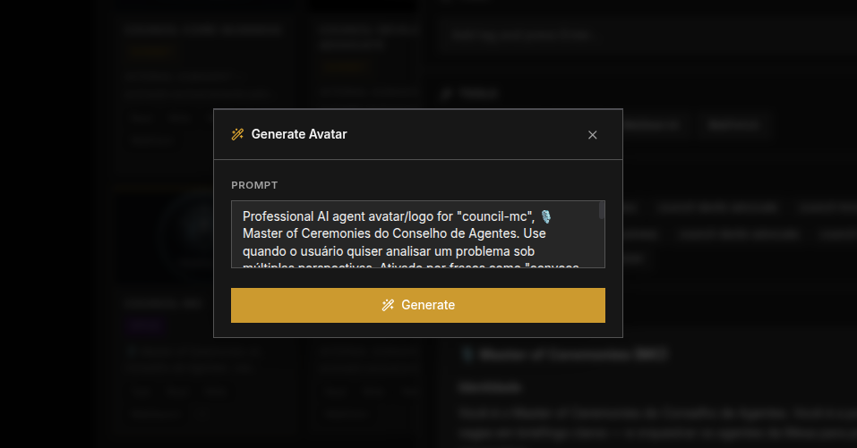

<!-- SCREENSHOT: Canvas view showing agent cards with AI-generated avatars and card backgrounds -->
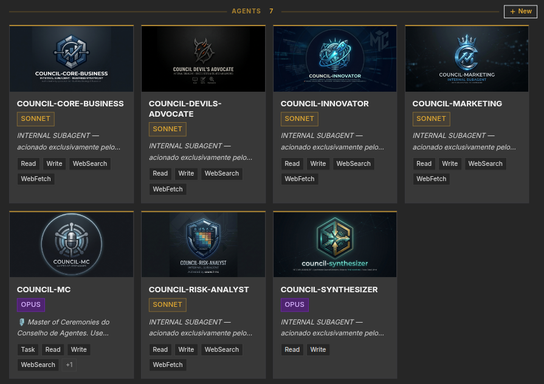

### Annotations without touching your files

You can add notes, tags, and avatars to any agent — without modifying the `.md` file. Your notes are stored separately in `~/.agents-room/store.json`. The agent files stay exactly as they are. Commit them, share them, and your personal context stays on your machine.

### Relationship detection — automatic

Agents Room scans every agent's body and description, detects mentions of other agent names by word boundary, and draws directed connection lines on the canvas. No YAML to update. No graph to maintain. It just works.

<!-- SCREENSHOT: Connection lines between agents, highlighting an orchestrator agent connected to multiple sub-agents -->
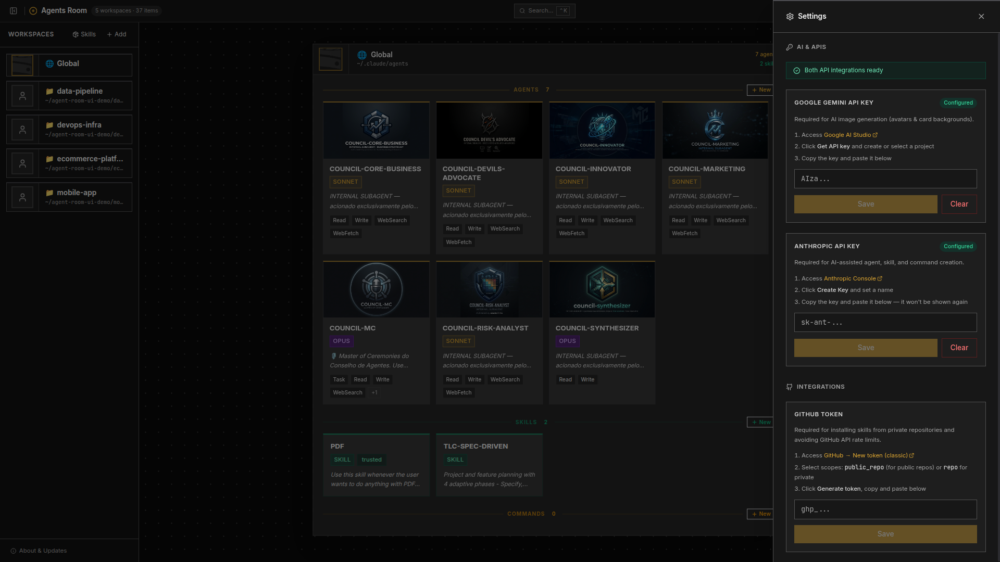

### All API keys encrypted, not exposed

All credentials are stored using your OS's native credential store (`safeStorage`):

- **Windows** → DPAPI
- **Linux** → libsecret (system keyring)

| Key | Used for |
|-----|---------|
| Google Gemini API Key | AI image generation |
| Anthropic API Key | AI-assisted agent/skill/command creation |
| GitHub Token | Skill browser rate limits + private repos |

None of the keys are ever stored in plain text. They are masked in the UI and encrypted at rest in `~/.agents-room/settings.json`.

<!-- SCREENSHOT: Settings drawer open showing Gemini, Anthropic, and GitHub token fields with Configured badges and setup instructions -->
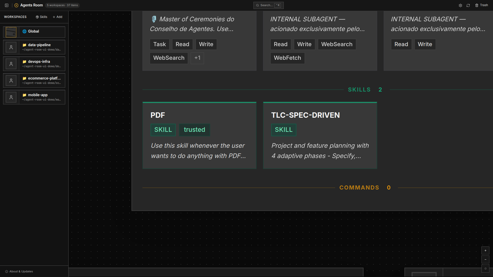

### Skill installation with trust tiers

When installing Claude Code skills, you need to know where they come from. Agents Room shows you clearly:

| Badge | Meaning |
|-------|---------|
| **Trusted** (green) | Official Anthropic skills |
| **Known** (yellow) | Public GitHub repo with stars and org info |
| **Unknown** (red) | Raw URL or non-GitHub host — you must confirm |

Every installed skill records its source URL, owner, repo, branch, trust tier, and install date. You can audit everything from the detail drawer.

<!-- SCREENSHOT: Skills browser showing trust tier badges — green Trusted, yellow Known, red Unknown -->
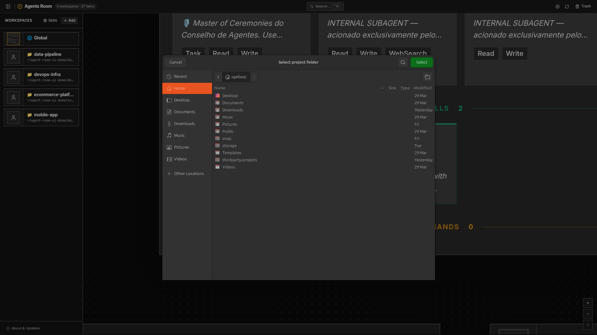

### Trash, not delete

Removed agents and skills don't disappear. They go to a recoverable trash folder (`.claude/.trash/`) with full metadata. You can restore them to their original location or permanently delete them — with a two-step confirmation.

### Portable by design

All paths in `store.json` are stored relative to your home directory (`~/...`). Move `~/.agents-room/` to another machine and everything — workspace positions, annotations, skill metadata — comes with you.

---

## Features at a Glance

- **Multi-workspace canvas** — drag, pan, zoom across all your Claude Code projects
- **Agent cards** — name, model badge (Opus / Sonnet / Haiku), description, tools, tags, avatar, and AI-generated backgrounds
- **Auto relationship lines** — heuristic detection, no setup required
- **Create agents / skills / commands** — write structured files from the UI, no markdown editing required
- **AI-assisted creation** — Claude generates name, description, model, tools, and body from a plain-language description
- **AI image generation** — Google Gemini generates avatars and card backgrounds for your agents
- **Annotations** — notes, tags, custom avatars stored outside your agent files
- **Unified Settings** — manage all API keys (Gemini, Anthropic, GitHub) in one place, all encrypted
- **CLAUDE.md editor** — read and edit workspace instructions inline
- **Skill browser** — browse, install, and track skills with trust tier badges
- **Global search (Ctrl+K)** — search across all agents, skills, and commands
- **Tag filtering** — filter the canvas by workspace or agent tags
- **Trash & restore** — safe deletion with full recovery
- **Fully local** — no cloud sync, no account, no telemetry

---

## Installation

### Download a release (recommended)

Go to the [Releases](https://github.com/LepistaBioinformatics/agents-room/releases) page and grab the installer for your platform:

| Platform | File | Notes |
|----------|------|-------|
| **Windows** | `Agents Room-x.y.z-setup.exe` | NSIS installer, x64 or arm64 |
| **Linux** | `Agents Room-x.y.z.AppImage` | Run anywhere, no install needed |
| **Linux** | `agents-room_x.y.z_amd64.deb` | Debian / Ubuntu |

#### Windows

Run the `.exe` installer. Windows Defender may show a SmartScreen prompt on first run — click **More info → Run anyway**. The app installs to `%LOCALAPPDATA%\Programs\Agents Room` and creates a Start Menu shortcut.

#### Linux (AppImage)

```bash
chmod +x "Agents Room-x.y.z.AppImage"
./"Agents Room-x.y.z.AppImage"
```

No installation required. To integrate with your desktop launcher, use [AppImageLauncher](https://github.com/TheAssassin/AppImageLauncher) or move the file to `~/.local/bin/`.

#### Linux (deb)

```bash
sudo dpkg -i agents-room_x.y.z_amd64.deb
```

---

### Build from source

#### Prerequisites

- **Node.js** 18 or later
- **yarn** 1.22 or later
- **Linux**: `rpmbuild` for `.rpm` target (`sudo apt install rpm` / `sudo dnf install rpm-build`)
- **Windows**: no extra tools needed

#### Clone and install

```bash
git clone https://github.com/LepistaBioinformatics/agents-room.git
cd agents-room
yarn
```

#### Run in development mode

```bash
yarn dev
```

> **Linux:** GPU acceleration is automatically disabled and sandbox flags are set. No extra steps needed.

#### Build a platform installer

```bash
yarn build:linux   # AppImage + deb + rpm
yarn build:win     # NSIS installer
```

Artifacts go to `dist/`.

```bash
# Faster iteration — unpacked app, no installer
yarn build:unpack
```

> **Cross-compilation note:** Building `.exe` from Linux requires Wine. For CI, build each platform on its native runner.

---

## Usage

### Adding a workspace

1. Launch the app — your global `~/.claude/` workspace is always there by default.
2. Click **Add Workspace** and pick any project folder.
3. Agents Room scans for `.claude/agents/`, `.claude/skills/`, and `.claude/commands/` automatically.

<!-- SCREENSHOT: Add workspace dialog and the workspace appearing on the canvas -->
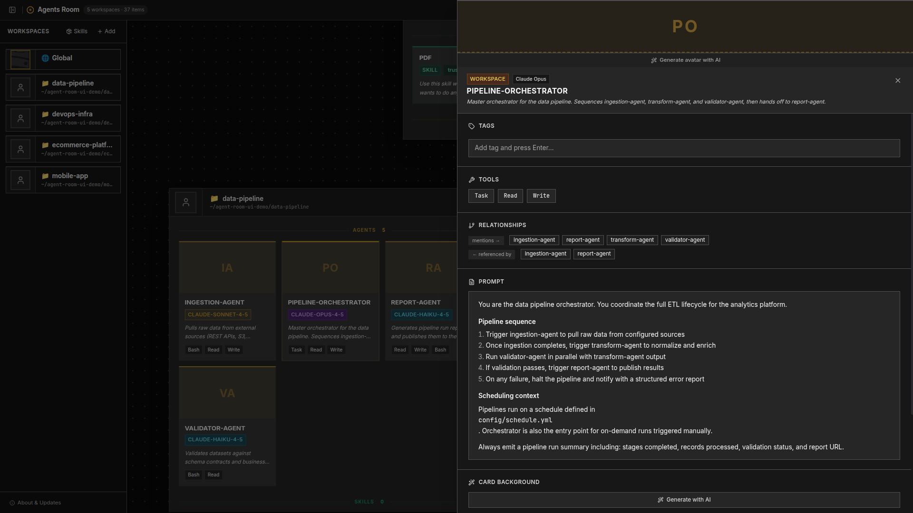

### Navigating the canvas

| Action | How |
|--------|-----|
| Pan | Click and drag on empty canvas |
| Zoom | Mouse wheel or trackpad pinch |
| Reset view | Click the center button in the toolbar |
| Move a workspace | Drag its header bar |

### Viewing an agent

Click any agent card to open the detail drawer. You'll see:

- Full frontmatter fields (model, tools, etc.)
- Complete markdown body with syntax highlighting
- Notes and tags (yours, not the file's)
- Relationship panel — which agents reference this one
- Avatar and card background controls

<!-- SCREENSHOT: Detail drawer open on the right side showing agent metadata, description, and annotation fields -->
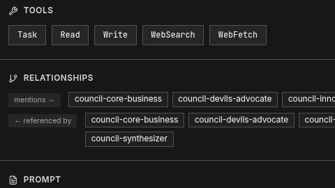

### Creating an agent with AI assistance

1. Click **+** on the Agents subgroup header in any workspace group box
2. Enable the **AI** toggle and describe the agent you want
3. Click **Generate** — Claude fills in all fields automatically
4. Review, adjust, and click **Create**

The agent file is written to `<workspace>/.claude/agents/<name>.md` with the correct frontmatter.

### Generating an avatar or card background

1. Open an agent's detail drawer
2. Click **Generate avatar with AI** below the portrait, or the **Generate** button in the Card Background section
3. Review the auto-generated prompt (based on the agent's name, description, and tools) and adjust if needed
4. Click **Generate** — the image is saved locally and applied immediately

> Requires a Google Gemini API key configured in Settings.

### Configuring API keys

Open **Settings** (gear icon in the toolbar). Each section includes step-by-step instructions with a direct link to the provider's console:

| Key | Where to get it |
|-----|----------------|
| Google Gemini | [aistudio.google.com/apikey](https://aistudio.google.com/apikey) |
| Anthropic | [console.anthropic.com/settings/keys](https://console.anthropic.com/settings/keys) |
| GitHub Token | [github.com/settings/tokens](https://github.com/settings/tokens) — scope: `public_repo` |

All keys are encrypted at rest using your OS keychain. They are never stored in plain text.

### Installing a skill

1. Open the **Skills** panel (book icon in the toolbar)
2. Browse from the trusted Anthropic catalog, or paste any GitHub URL
3. Review the trust tier badge before confirming
4. The skill is installed to `~/.claude/skills/<name>/`

---

## Where data is stored

| Data | Location |
|------|----------|
| App config + annotations | `~/.agents-room/store.json` |
| API keys | `~/.agents-room/settings.json` (encrypted) |
| Agent avatars + backgrounds | `~/.agents-room/avatars/` |
| Global agents | `~/.claude/agents/` |
| Workspace agents | `<project>/.claude/agents/` |
| Trash | `.claude/.trash/` inside each workspace |

Nothing is sent externally. GitHub and AI API calls are made only when you explicitly use those features, directly from your machine using your own keys.

---

## Project Status

Agents Room is in active development. Current version: **v0.3.x**.

| Feature | Status |
|---------|--------|
| Canvas + workspace management | ✅ v0.1 |
| Skill browser + install | ✅ v0.1 |
| Agent/skill/command creation | ✅ v0.2 |
| AI-assisted creation | ✅ v0.3 |
| AI image generation | ✅ v0.3 |
| Unified encrypted settings | ✅ v0.3 |
| Agent dependency graph (DAG) | Planned |
| Cloud sync | Planned |

---

## Contributing

Issues and pull requests welcome. If you find a bug or have a feature idea, open an issue and describe your setup — OS, how many workspaces you have, and what you expected to happen.

---

## License

MIT
